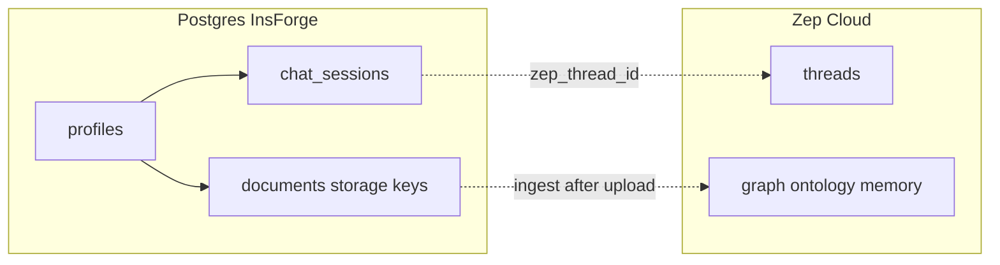

# Medtrace — InsForge DBMS design

PostgreSQL on **InsForge** for **application persistence only**: users, sessions, document registry, and **InsForge Storage** references. **Zep** continues to own clinical ontology, graph, threads, and episodic memory — nothing from the ontology is mirrored into SQL.

---

## Scope

| Concern | Role of Postgres |
|--------|-------------------|
| **User** | InsForge `auth.users` plus app table **`profiles`** (display name, optional role/metadata). |
| **Session** | Durable **`chat_sessions`** (e.g. `zep_thread_id`, title, activity) per logged-in user, optionally scoped to a **chart subject** so a page reload can restore context. JWT/browser session remains InsForge auth; this table is **app session records**, not a replacement for auth tokens. |
| **Document** | **Registry** rows: stable `doc_id`, **`document_kind`**, filename, `extract_mode`, `episode_count` (optional), timestamps, FKs. No clinical fact rows — structure stays in Zep. |
| **Storage** | **InsForge Storage bucket** holds file bytes. Each document row stores **`storage_bucket`**, **`storage_key`**, **`storage_url`** (SDK: keep both key and URL for download/delete). Postgres does not store blobs. |

### Document kinds (single table)

Use **one `documents` table** with **`document_kind`** (CHECK constraint), not separate tables for radiology vs conversation notes.

- Same lifecycle: upload → InsForge Storage → insert row → Zep `graph.add` from extracted text as in the current app.
- One set of RLS policies, indexes, and queries (e.g. filter by `document_kind`).

**When two tables would make sense:** only if radiology vs conversation documents later need **different required columns or foreign keys**. Until then, use **`metadata jsonb`** for extras.

**Allowed `document_kind` values (v1):**

| Value | Meaning |
|--------|---------|
| `clinical_pdf` | PDF medical-history uploads (vision or pypdf). App code may still use labels like `pdf_medical_history` at the edge. |
| `radiology_note` | Radiology-style note/file ingest (see `data/radiology_note/` in the repo). |
| `conversation_note` | Session/conversation-style notes (maps from legacy **`session_note`** / `data/session_note/` if you keep that folder name in code). |

---

## Out of scope for this DBMS

- No relational mirror of conditions, medications, encounters, clinical facts, or other entities from `src/medtrace_agent/ontology/clinical.py`.
- No dual-write of Zep graph content into Postgres.
- Graph search, ontology, and memory remain **Zep-only**.

---

## Schema diagram (v1)

```mermaid
erDiagram
  auth_users ||--|| profiles : "id = auth.users.id"
  profiles ||--o{ chart_subjects : owner_profile_id
  profiles ||--o{ chat_sessions : profile_id
  profiles ||--o{ documents : profile_id
  chart_subjects ||--o{ chat_sessions : chart_subject_id
  chart_subjects ||--o{ documents : chart_subject_id

  auth_users {
    uuid id PK
    text email
  }

  profiles {
    uuid id PK_FK
    text display_name
    text role
    jsonb metadata
    timestamptz created_at
    timestamptz updated_at
  }

  chart_subjects {
    uuid id PK
    uuid owner_profile_id FK
    text zep_user_id
    text display_name
    timestamptz created_at
  }

  chat_sessions {
    uuid id PK
    uuid profile_id FK
    uuid chart_subject_id FK
    text zep_thread_id UK
    text title
    timestamptz created_at
    timestamptz updated_at
  }

  documents {
    uuid id PK
    text doc_id UK
    uuid profile_id FK
    uuid chart_subject_id FK
    text document_kind
    text filename
    text extract_mode
    int episode_count
    text storage_bucket
    text storage_key
    text storage_url
    jsonb metadata
    timestamptz uploaded_at
  }
```

**Cardinality**

- One **profile** per **`auth.users`** row (1:1).
- A user may own many **chart_subjects** (saved patient charts in the UI).
- **Chat sessions** and **documents** reference **profile_id**; optionally **chart_subject_id** (Zep `zep_user_id` is stored on **chart_subjects**).

---

## SQL DDL (v1)

Run after InsForge auth exists (`auth.users`). Uses `gen_random_uuid()` (typically `pgcrypto` on InsForge).

```sql
-- 1:1 app profile for each auth user
CREATE TABLE public.profiles (
  id uuid PRIMARY KEY REFERENCES auth.users (id) ON DELETE CASCADE,
  display_name text,
  role text,
  metadata jsonb NOT NULL DEFAULT '{}',
  created_at timestamptz NOT NULL DEFAULT now(),
  updated_at timestamptz NOT NULL DEFAULT now()
);

-- Chart subject = demo patient scope + Zep user id (no clinical facts stored here)
CREATE TABLE public.chart_subjects (
  id uuid PRIMARY KEY DEFAULT gen_random_uuid(),
  owner_profile_id uuid NOT NULL REFERENCES public.profiles (id) ON DELETE CASCADE,
  zep_user_id text NOT NULL,
  display_name text,
  created_at timestamptz NOT NULL DEFAULT now(),
  CONSTRAINT chart_subjects_owner_zep_unique UNIQUE (owner_profile_id, zep_user_id)
);

CREATE INDEX idx_chart_subjects_owner ON public.chart_subjects (owner_profile_id);
CREATE INDEX idx_chart_subjects_zep ON public.chart_subjects (zep_user_id);

-- Durable chat session (ties UI thread to Zep thread id)
CREATE TABLE public.chat_sessions (
  id uuid PRIMARY KEY DEFAULT gen_random_uuid(),
  profile_id uuid NOT NULL REFERENCES public.profiles (id) ON DELETE CASCADE,
  chart_subject_id uuid REFERENCES public.chart_subjects (id) ON DELETE SET NULL,
  zep_thread_id text NOT NULL,
  title text,
  created_at timestamptz NOT NULL DEFAULT now(),
  updated_at timestamptz NOT NULL DEFAULT now(),
  CONSTRAINT chat_sessions_zep_thread_unique UNIQUE (zep_thread_id)
);

CREATE INDEX idx_chat_sessions_profile ON public.chat_sessions (profile_id);
CREATE INDEX idx_chat_sessions_chart ON public.chat_sessions (chart_subject_id);

-- Document registry: InsForge bucket object + kind
CREATE TABLE public.documents (
  id uuid PRIMARY KEY DEFAULT gen_random_uuid(),
  doc_id text NOT NULL,
  profile_id uuid NOT NULL REFERENCES public.profiles (id) ON DELETE CASCADE,
  chart_subject_id uuid REFERENCES public.chart_subjects (id) ON DELETE SET NULL,
  filename text NOT NULL,
  document_kind text NOT NULL CHECK (
    document_kind IN ('clinical_pdf', 'radiology_note', 'conversation_note')
  ),
  extract_mode text,
  episode_count integer,
  storage_bucket text NOT NULL,
  storage_key text NOT NULL,
  storage_url text,
  metadata jsonb NOT NULL DEFAULT '{}',
  uploaded_at timestamptz NOT NULL DEFAULT now(),
  CONSTRAINT documents_doc_id_unique UNIQUE (doc_id)
);

CREATE INDEX idx_documents_profile ON public.documents (profile_id);
CREATE INDEX idx_documents_chart ON public.documents (chart_subject_id);
CREATE INDEX idx_documents_kind ON public.documents (document_kind);
CREATE INDEX idx_documents_chart_kind ON public.documents (chart_subject_id, document_kind);
```

### Smaller variant (no `chart_subjects`)

Drop **`chart_subjects`** and remove **`chart_subject_id`** from **`chat_sessions`** and **`documents`**. Keep **`profile_id`** only; put **`zep_user_id`** in **`metadata`** when you still need Zep correlation.

---

## Table summary

| Table | Purpose |
|--------|---------|
| **profiles** | App row per auth user (`id` = `auth.users.id`). |
| **chart_subjects** | Chart/patient scope + `zep_user_id` for Zep APIs. |
| **chat_sessions** | One row per chat thread; `zep_thread_id` matches Zep. |
| **documents** | Registry + **`document_kind`** + InsForge **`storage_*`** columns. |

---

## Zep vs InsForge boundaries



After upload, **InsForge Storage** holds the file; extraction/chunking and **`graph.add`** behave as today. Postgres stores **kind**, **ids**, and **storage location**, not ontology content.

---

## InsForge setup checklist

1. `npx @insforge/cli create` or `npx @insforge/cli link` → `.insforge/project.json` (gitignored).
2. Create a **storage bucket** (CLI), e.g. `npx @insforge/cli storage create-bucket medtrace-documents`.
3. Apply the migration in this repo: `npx @insforge/cli db migrations up 20260510083259_medtrace-app-schema.sql`.
4. Seed a `profiles` row for your app user (or sign up in the hosted app) so `INSFORGE_PROFILE_ID` matches `auth.users.id`.
5. Add **RLS** when exposing multi-user access (`profile_id` / `owner_profile_id` ↔ `auth.uid()`).

## Streamlit persistence (optional)

When `INSFORGE_URL`, `INSFORGE_API_KEY`, and `INSFORGE_PROFILE_ID` are set in `.env` / `.env.local`, the app uploads files to the InsForge bucket and records rows in `documents`, and syncs `chart_subjects` + `chat_sessions`. See `.env.example` and `medtrace_agent.insforge_api`.
