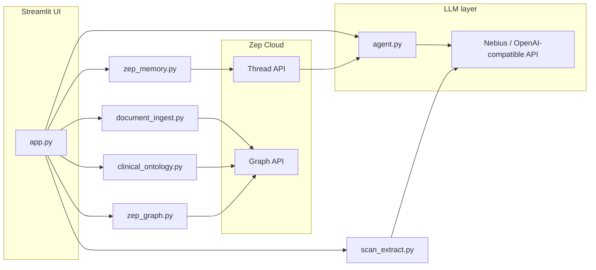
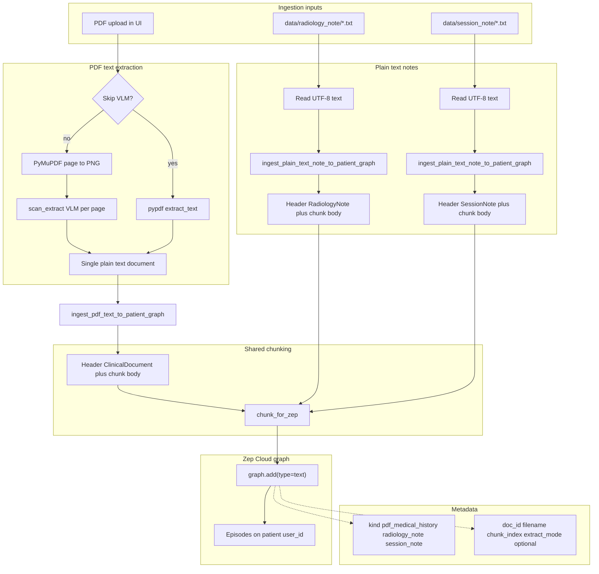

# Medtrace Agent —

**“clinical decision support” or “cognitive aid”**: not replacing the doctor, but surfacing **patterns, timelines, and test ideas** the clinician still validates.


#  Architecture

Streamlit demo that combines **Zep Cloud** (long-term memory + temporal knowledge graph) with a **LangChain / OpenAI-compatible chat model** (default: Nebius Token Factory). This document describes how the pieces fit together.

## High-level picture




- **UI** owns session state (patient id, thread id, ingested-document registry, chat history).
- **Agent** builds the system prompt (Zep context + optional document catalog), calls the LLM, returns plain text.
- **Zep** stores conversational turns on **threads** and structured memories / episodes on the **user graph** (PDF chunks, extracted facts, ontology-backed nodes).

## Module responsibilities


| Module                 | Role                                                                                                                                                                                                                                                                                                                                    |
| ---------------------- | --------------------------------------------------------------------------------------------------------------------------------------------------------------------------------------------------------------------------------------------------------------------------------------------------------------------------------------- |
| `app.py`               | Streamlit layout: sidebar (patient, PDF upload, ontology apply, graph controls), chat column, graph inspector column. Orchestrates bootstrap, each chat turn, and PDF ingest loops.                                                                                                                                                     |
| `agent.py`             | `chat_with_memory(...)`: composes system prompt from base instructions, **Memory context** (`zep_context`), and **Ingested clinical documents** (`document_catalog`). Invokes `ChatOpenAI` against Nebius base URL + API key.                                                                                                           |
| `zep_memory.py`        | Zep client singleton; `ensure_user`, `ensure_session` (thread create); `fetch_thread_context` (`thread.get_user_context` + `thread.get` message tail); `append_turn` (`thread.add_messages`). Handles duplicate-user / duplicate-thread `BadRequestError` shapes.                                                                       |
| `zep_graph.py`         | Read-only inspector: episodes by user, temporal edges by user, ontology-scoped `graph.search` for nodes/edges. Returns `pandas` frames for Streamlit.                                                                                                                                                                                   |
| `document_ingest.py`   | `pdf_bytes_to_text(...)` (PDF → `**scan_extract`** VLM or `**pypdf**`). `**ingest_pdf_text_to_patient_graph**`, `**ingest_plain_text_note_to_patient_graph**`, `**ingest_txt_path_to_patient_graph**` for `**data/radiology_note/**` and `**data/session_note/**` `.txt` files. All paths use `**chunk_for_zep**` then `**graph.add**`. |
| `scan_extract.py`      | `**pdf_to_page_images_png**`, `**vl_extract_single_page**` (LangChain `ChatOpenAI` + vision), Pydantic `**PageVLMExtract**`, `**pdf_bytes_via_vlm**` / `**serialize_pages_for_ingest**`.                                                                                                                                                |
| `clinical_ontology.py` | Clinical demo ontology (entity + edge type definitions). `apply_clinical_ontology` calls `graph.set_ontology` (default: project-wide registration so dashboard visibility matches Zep docs).                                                                                                                                            |


## Zep: thread vs graph

Understanding this split is central to the architecture.

### Thread (short dialog + rolling context)

- Identified by `**thread_id**` (the app calls this the “session” in places; Zep SDK uses `thread`).
- `**thread.get_user_context(thread_id)**` returns synthesized context for the model (facts Zep derives from history + graph).
- `**thread.get(thread_id, lastn=…)**` supplies recent messages for LangChain (short-term conversational continuity).
- `**thread.add_messages**` appends the latest user + assistant turns after each reply so Zep can absorb them into memory.

Threads are **per conversation session**; changing “New thread” creates a new id while keeping the same **user** (`zep_user_id`), so long-term recall can still attach to the patient user in Zep.

### Graph (episodes, facts, ontology)

- `**graph.add`** ingests PDF-derived **text** episodes tagged with metadata (`doc_id`, filename, etc.). Zep’s pipeline turns content into episodes and, over time, **temporal edges / facts** visible in the inspector.
- `**graph.set_ontology`** registers custom entity and edge types for extraction (clinical demo schema).
- `**graph.episode.get_by_user_id**` / `**graph.edge.get_by_user_id**` back the Streamlit “Knowledge graph inspector”.
- `**graph.search**` powers ontology-filtered lookups in the UI.

The **patient** is modeled as a Zep **user** (`zep_user_id`). All graph reads/writes for that demo patient use this id.

## Chat turn sequence

1. User submits a message in Streamlit.
2. `**fetch_thread_context(thread_id)`** → `zep_context` string + last N `Message` objects from Zep.
3. `**_format_document_catalog(ingested_docs)**` builds a bullet list of PDFs registered **in this Streamlit session** (`doc_id`, filename, upload time, episode count).
4. `**chat_with_memory`** builds `SystemMessage` + LangChain history + new `HumanMessage`, calls the LLM.
5. Assistant text is shown; if PDFs were registered this session, a **caption** under the bubble lists those documents (deterministic UI). The prompt also asks the model for a final `**Sources:`** line when the catalog is present.
6. `**append_turn**` pushes user + assistant strings to Zep via `**thread.add_messages**`.

## PDF ingest sequence

**Default (vision):** every PDF is rendered **page-by-page to PNG** with **PyMuPDF** (`fitz`). Each image is sent to `**NEBIUS_VL_MODEL`** via OpenAI-compatible `**ChatOpenAI**` (multimodal messages). The model returns **JSON** (structured clinical fields + `**page_visible_text`** transcript), validated with **Pydantic**, then concatenated into one plain-text document by `**serialize_pages_for_ingest`**.

**Optional fast path (“Skip VLM” in the UI):** `**pdf_bytes_to_text_pypdf`** reads only the embedded text layer (`pypdf`). Cheaper and faster for born-digital PDFs; **does not** read scanned pages, handwriting, or text that exists only inside embedded bitmaps.

Then, for each file:

1. The app assigns a `**doc_id`** and calls `**ingest_pdf_text_to_patient_graph**`, which `**chunk_for_zep**` splits the document and `**graph.add(type="text", ...)**` uploads each chunk (header includes `doc_id` / filename / chunk index). Metadata records `**extract_mode**` (`vlm_png` vs `pypdf`).
2. Returned episode UUIDs are counted; `**ingested_docs**` is updated so chat can cite `**doc_id` / filename**.

**Cost note:** vision ingest runs **one VLM call per page** (plus an occasional JSON repair call). Use `**PDF_VL_MAX_PAGES`** and sidebar limits to cap spend; lower `**PDF_VL_DPI**` to shrink images.

## Document ingestion architecture

End-to-end flow for **PDF uploads**, `**data/radiology_note/*.txt`**, and `**data/session_note/*.txt**`: all sources normalize to **chunked text** with per-source headers and metadata, then `**graph.add(type="text")`** on the patient `**user_id**`.




| Route                         | Typical Zep metadata `**kind**` | Chunk header prefix    |
| ----------------------------- | ------------------------------- | ---------------------- |
| PDF (default VLM or Skip VLM) | `pdf_medical_history`           | `[ClinicalDocument …]` |
| `data/radiology_note/*.txt`   | `radiology_note`                | `[RadiologyNote …]`    |
| `data/session_note/*.txt`     | `session_note`                  | `[SessionNote …]`      |


## Vision ingest risks

Vision models can **misread numbers** or **hallucinate** structured fields. Treat output as **demo-grade** unless validated. Not a certified medical device or OCR pipeline.

## Session state (important caveats)

- `**ingested_docs`** lives only in the browser session. Reloading Streamlit clears it; Zep may still retain graph episodes from earlier runs.
- **Document catalog** injected into the LLM is derived from `**ingested_docs`**, not from a live Zep query. After a reload, citations may rely on memory alone until PDFs are re-ingested or registry persistence is added.

## Configuration

See `.env.example`. Required:

- `**NEBIUS_API_KEY**` — Token Factory / OpenAI-compatible endpoint for `ChatOpenAI`.
- `**ZEP_API_KEY**` — Zep Cloud project.

Optional env vars (defaults in code): `NEBIUS_BASE_URL`, `NEBIUS_MODEL`.

Vision PDF ingest (required for default ingest unless the user enables **Skip VLM** in the UI):

- `**NEBIUS_VL_MODEL`** — multimodal model slug on the same OpenAI-compatible base URL as chat.
- `**PDF_VL_MAX_PAGES**` (default `25`), `**PDF_VL_DPI**` (default `150`) — caps and render quality for PyMuPDF rasterization.

## Running (minimal)

```bash
python -m venv .venv
source .venv/bin/activate   # or Windows equivalent
pip install -r requirements.txt
cp .env.example .env        # fill keys
streamlit run app.py
```

## Dependency stack

- **streamlit** — UI and session state  
- **zep-cloud** (v3) — `Zep` client, thread + graph APIs  
- **langchain-openai** / **langchain-core** — `ChatOpenAI` pointed at Nebius  
- **pandas** — tables for the graph inspector  
- **pypdf** — optional fast text-layer extraction (Skip VLM)  
- **pymupdf** — PDF page rasterization for vision ingest  
- **pydantic** — validate VLM JSON before Zep ingest

