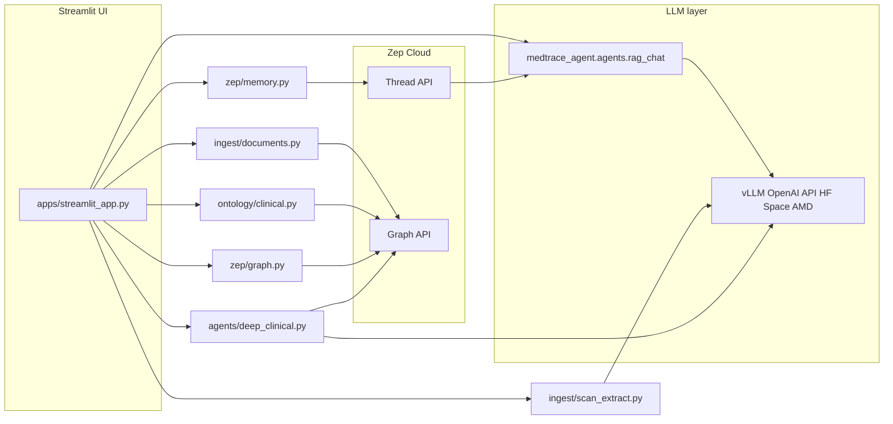
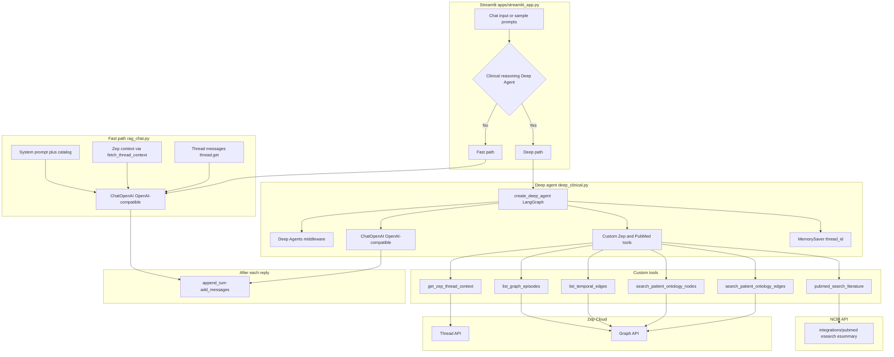
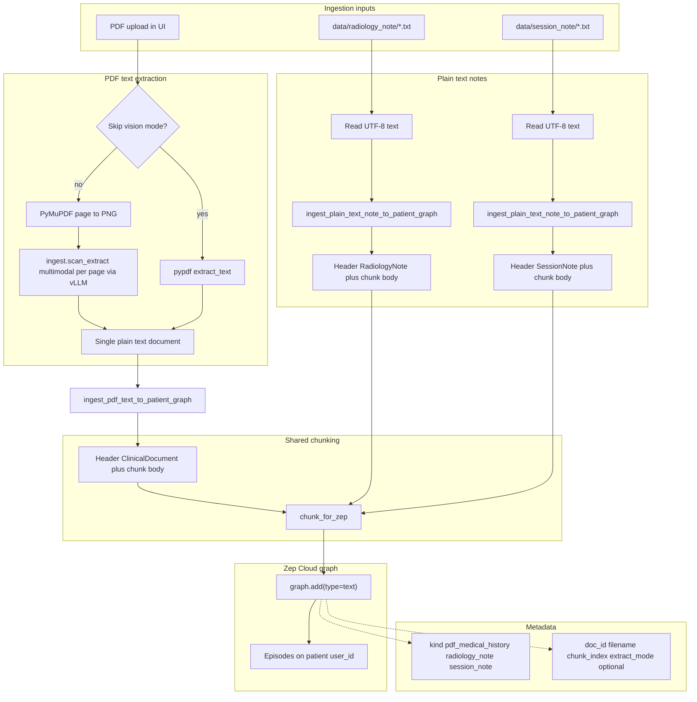

# Medtrace Agent —

**“clinical decision support” or “cognitive aid”**: not replacing the doctor, but surfacing **patterns, timelines, and test ideas** the clinician still validates.

## Sponsors & inference stack

This project highlights an inference stack built with **sponsor** technologies:

- **[AMD](https://www.amd.com/)** — **GPU acceleration for fine-tuning** our **custom** clinical models and for **high-throughput inference** when serving checkpoints.
- **[Hugging Face](https://huggingface.co/)** — model artifacts, hub distribution, and **[Spaces](https://huggingface.co/docs/hub/spaces)** deployment for the **OpenAI-compatible** endpoints this app calls.
- **[vLLM](https://docs.vllm.ai/en/latest/)** — we serve models behind LangChain using vLLM’s **[OpenAI-compatible server](https://docs.vllm.ai/en/latest/serving/openai_compatible_server/)** (`/v1/chat/completions` and related routes), so **`ChatOpenAI`** works without a vendor-specific SDK.

Chat and **PDF page vision** (multimodal messages for structured extraction) both target the same style of endpoint: a **Hugging Face Space** (or compatible host) running **vLLM** on **AMD** hardware.

Authentication for those endpoints is **optional** whenever your Space or gateway does not require a key; add a bearer token or API key only if your deployment enforces it (see [Configuration](#configuration)).

#  Architecture

Streamlit demo that combines **Zep Cloud** (long-term memory + temporal knowledge graph) with **`ChatOpenAI`** pointed at an **OpenAI-compatible** endpoint. The **custom** [**MedGemma 1.5 4B IT (GGUF)**](https://huggingface.co/gguf-org/medgemma-1.5-4b-it-gguf) checkpoint (`gguf-org/medgemma-1.5-4b-it-gguf` on Hugging Face) is **fine-tuned** on **AMD** GPUs; we **deploy** inference on **[Hugging Face Spaces](https://huggingface.co/docs/hub/spaces)** behind **[vLLM’s OpenAI-compatible server](https://docs.vllm.ai/en/latest/serving/openai_compatible_server/)** for both chat and multimodal PDF ingest. Details: [LLM model](#llm-model) and [Sponsors & inference stack](#sponsors--inference-stack).

## LLM model

Clinical chat and agents use **`ChatOpenAI`** against the **OpenAI-compatible** base URL and model id you configure (names and defaults live in **`.env.example`**).

- **Weights:** [gguf-org/medgemma-1.5-4b-it-gguf](https://huggingface.co/gguf-org/medgemma-1.5-4b-it-gguf) on **Hugging Face** (GGUF packaging for efficient serving).
- **Fine-tuning:** performed using **AMD** GPU infrastructure (sponsor).
- **Deployment:** models are served from a **[Hugging Face Space](https://huggingface.co/docs/hub/spaces)** running **[vLLM](https://docs.vllm.ai/en/latest/)** with the **[OpenAI-compatible HTTP API](https://docs.vllm.ai/en/latest/serving/openai_compatible_server/)**; point the app’s base URL and model id at that Space (or equivalent endpoint).
- **PDF vision ingest:** each page image is sent to a **multimodal-capable** model using the same OpenAI-style **`/v1/chat/completions`** flow (see vLLM docs on multimodal serving); configure the vision base URL, model id, and API mode in **`.env.example`**. Pure text checkpoints do not replace the vision ingest path unless you use text-only extraction in the UI (**Skip VLM** matches the Streamlit control label).

## High-level picture




- **UI** owns session state (patient id, thread id, ingested-document registry, chat history).
- **Agent** — default **`chat_with_memory`** builds the system prompt (Zep context + optional document catalog) and calls the LLM once. Optional **Clinical reasoning (Deep Agent)** uses **`medtrace_agent.agents.deep_clinical`** (`create_deep_agent`) with Zep tools + PubMed (`integrations/pubmed`).
- **Zep** stores conversational turns on **threads** and structured memories / episodes on the **user graph** (PDF chunks, extracted facts, ontology-backed nodes).

## AI agent architecture

How **`apps/streamlit_app.py`** chooses between the **fast RAG chat** and the **Deep Clinical Agent**, and how each connects to the configured OpenAI-compatible chat API, Zep, and PubMed.



| Piece | Role |
|--------|------|
| **Fast path** | Single **`chat_with_memory`** call: system prompt + Zep **`thread.get_user_context`** text (via **`fetch_thread_context`**) + recent **`thread.get`** messages + optional ingested-document catalog. **No tool loop.** |
| **Deep path** | **`create_deep_agent`** with the same configured **`ChatOpenAI`**, custom tools for Zep graph + PubMed, **`MemorySaver`** keyed by Streamlit **`thread_id`**, plus built-in Deep Agents middleware (planning, virtual filesystem, subagents — not shown in detail). |
| **PubMed** | **`medtrace_agent.integrations.pubmed`** — NCBI **E-utilities** (`esearch` / `esummary`) over HTTP JSON, **not** HTML scraping. |

## Repository layout

| Path | Purpose |
|------|---------|
| `pyproject.toml` | Package metadata, dependencies, pytest config (`medtrace-agent`, installable from `src/`). |
| `src/medtrace_agent/` | Importable package: `zep`, `ontology`, `integrations`, `agents`, `ingest`. |
| `apps/streamlit_app.py` | Streamlit entrypoint (demo UI). |
| `tests/` | Pytest suite (`pip install -e ".[dev]"` includes pytest). |
| `data/` | Sample note paths (PDFs/notes gitignored; keep `.gitkeep` where needed). |

## Module responsibilities


| Module | Role |
| ------ | ---- |
| `apps/streamlit_app.py` | Streamlit layout: sidebar (patient, **Clinical reasoning (Deep Agent)** checkbox, PDF upload, ontology, graph controls), chat column, graph inspector. Dual chat path: **`chat_with_memory`** vs **`run_clinical_deep_agent_turn`**. |
| `medtrace_agent.agents.rag_chat` | `chat_with_memory(...)`: composes system prompt from base instructions, **Memory context** (`zep_context`), and **Ingested clinical documents** (`document_catalog`). Invokes `ChatOpenAI` against the configured OpenAI-compatible chat endpoint. |
| `medtrace_agent.agents.deep_clinical` | **`create_deep_agent`** (LangChain Deep Agents): Zep tools (`get_zep_thread_context`, episodes, edges, ontology search) + **`pubmed_search_literature`**, **`MemorySaver`** checkpointing keyed by Streamlit `thread_id`. Non-diagnostic CDS framing. |
| `medtrace_agent.integrations.pubmed` | NCBI **esearch** + **esummary** (JSON) for PubMed titles/PMIDs; uses **`NCBI_EMAIL`** / **`NCBI_API_KEY`** when set. |
| `medtrace_agent.zep.memory` | Zep client singleton; `ensure_user`, `ensure_session` (thread create); `fetch_thread_context` (`thread.get_user_context` + `thread.get` message tail); `append_turn` (`thread.add_messages`). Handles duplicate-user / duplicate-thread `BadRequestError` shapes. |
| `medtrace_agent.zep.graph` | Read-only inspector: episodes by user, temporal edges by user, ontology-scoped `graph.search` for nodes/edges. Returns `pandas` frames for Streamlit. |
| `medtrace_agent.ingest.documents` | `pdf_bytes_to_text(...)` (PDF → **`ingest.scan_extract`** vision path or **`pypdf`**). **`ingest_pdf_text_to_patient_graph`**, **`ingest_plain_text_note_to_patient_graph`**, **`ingest_txt_path_to_patient_graph`** for **`data/radiology_note/`** and **`data/session_note/`** `.txt` files. All paths use **`chunk_for_zep`** then **`graph.add`**. |
| `medtrace_agent.ingest.scan_extract` | **`pdf_to_page_images_png`**, **`vl_extract_single_page`** (LangChain `ChatOpenAI` + vision), Pydantic **`PageVLMExtract`**, **`pdf_bytes_via_vlm`** / **`serialize_pages_for_ingest`**. |
| `medtrace_agent.ontology.clinical` | Clinical demo ontology (entity + edge type definitions). `apply_clinical_ontology` calls `graph.set_ontology` (default: project-wide registration so dashboard visibility matches Zep docs). |


## Zep: thread vs graph

Understanding this split is central to the architecture.

### Thread (short dialog + rolling context)

- Identified by `**thread_id**` (the app calls this the “session” in places; Zep SDK uses `thread`).
- `**thread.get_user_context(thread_id)**` returns synthesized context for the model (facts Zep derives from history + graph).
- `**thread.get(thread_id, lastn=…)**` supplies recent messages for LangChain (short-term conversational continuity).
- `**thread.add_messages**` appends the latest user + assistant turns after each reply so Zep can absorb them into memory.

Threads are **per conversation session**; changing “New thread” creates a new id while keeping the same **user** (`zep_user_id`), so long-term recall can still attach to the patient user in Zep.

### Graph (episodes, facts, ontology)

- `**graph.add`** ingests PDF-derived **text** episodes tagged with metadata (`doc_id`, filename, etc.). Zep’s pipeline turns content into episodes and, over time, **temporal edges / facts** visible in the inspector.
- `**graph.set_ontology`** registers custom entity and edge types for extraction (clinical demo schema).
- `**graph.episode.get_by_user_id**` / `**graph.edge.get_by_user_id**` back the Streamlit “Knowledge graph inspector”.
- `**graph.search**` powers ontology-filtered lookups in the UI.

The **patient** is modeled as a Zep **user** (`zep_user_id`). All graph reads/writes for that demo patient use this id.

## Chat turn sequence

1. User submits a message in Streamlit.
2. `**fetch_thread_context(thread_id)`** → `zep_context` string + last N `Message` objects from Zep.
3. `**_format_document_catalog(ingested_docs)**` builds a bullet list of PDFs registered **in this Streamlit session** (`doc_id`, filename, upload time, episode count).
4. **Chat path** (sidebar):
   - **Default:** `**chat_with_memory**` builds `SystemMessage` + LangChain history + new `HumanMessage`, single LLM call.
   - **Clinical reasoning (Deep Agent):** `**run_clinical_deep_agent_turn**` runs **`create_deep_agent`** with Zep + PubMed tools and LangGraph **`MemorySaver`** (same `thread_id`). Slower; includes Deep Agents planning/filesystem middleware — demo only.
5. Assistant text is shown; optional captions for ingested-doc registry and Deep Agent turns.
6. `**append_turn**` pushes user + assistant strings to Zep via `**thread.add_messages**`.

### Clinical reasoning mode (constraints)

Educational demo only: outputs are **not** a diagnosis or substitute for clinical judgment. PubMed results depend on NCBI availability; set **`NCBI_EMAIL`** (and optionally **`NCBI_API_KEY`**) in `.env` for reliable E-utilities access.

## PDF ingest sequence

**Default (vision):** every PDF is rendered **page-by-page to PNG** with **PyMuPDF** (`fitz`). Each image is sent to the configured **multimodal** model via **`ChatOpenAI`** against a **[vLLM OpenAI-compatible](https://docs.vllm.ai/en/latest/serving/openai_compatible_server/)** endpoint—typically a **[Hugging Face Space](https://huggingface.co/docs/hub/spaces)** on **AMD** GPUs (sponsor stack). The model returns **JSON** (structured clinical fields + **`page_visible_text`** transcript), validated with **Pydantic**, then concatenated into one plain-text document by **`serialize_pages_for_ingest`**.

**Optional fast path (“Skip VLM” in the UI):** `**pdf_bytes_to_text_pypdf`** reads only the embedded text layer (`pypdf`). Cheaper and faster for born-digital PDFs; **does not** read scanned pages, handwriting, or text that exists only inside embedded bitmaps.

Then, for each file:

1. The app assigns a `**doc_id`** and calls `**ingest_pdf_text_to_patient_graph**`, which `**chunk_for_zep**` splits the document and `**graph.add(type="text", ...)**` uploads each chunk (header includes `doc_id` / filename / chunk index). Metadata records `**extract_mode**` (`vlm_png` vs `pypdf`).
2. Returned episode UUIDs are counted; `**ingested_docs**` is updated so chat can cite `**doc_id` / filename**.

**Cost note:** vision ingest runs **one multimodal inference call per page** (plus an occasional JSON repair call). Use `**PDF_VL_MAX_PAGES`** and sidebar limits to cap spend; lower `**PDF_VL_DPI**` to shrink images.

## Document ingestion architecture

End-to-end flow for **PDF uploads**, `**data/radiology_note/*.txt`**, and `**data/session_note/*.txt**`: all sources normalize to **chunked text** with per-source headers and metadata, then `**graph.add(type="text")`** on the patient `**user_id**`.




| Route                         | Typical Zep metadata `**kind**` | Chunk header prefix    |
| ----------------------------- | ------------------------------- | ---------------------- |
| PDF (default vision via vLLM or **Skip VLM** in UI) | `pdf_medical_history`           | `[ClinicalDocument …]` |
| `data/radiology_note/*.txt`   | `radiology_note`                | `[RadiologyNote …]`    |
| `data/session_note/*.txt`     | `session_note`                  | `[SessionNote …]`      |


## Vision ingest risks

Vision models can **misread numbers** or **hallucinate** structured fields. Treat output as **demo-grade** unless validated. Not a certified medical device or OCR pipeline.

## Session state (important caveats)

- `**ingested_docs`** lives only in the browser session. Reloading Streamlit clears it; Zep may still retain graph episodes from earlier runs.
- **Document catalog** injected into the LLM is derived from `**ingested_docs`**, not from a live Zep query. After a reload, citations may rely on memory alone until PDFs are re-ingested or registry persistence is added.

## Configuration

See **`.env.example`** for exact variable names and defaults.

**Required**

- `**ZEP_API_KEY**` — Zep Cloud project.

**OpenAI-compatible chat + PDF vision (optional credentials)**

- Set the **chat** base URL, model id, and any **bearer token / API key** only if your **Hugging Face Space** or gateway requires them; **vLLM** deployments often need **no** client secret when the Space is public.
- For **PDF page vision**, configure the vision base URL, multimodal model id, and API mode (`chat` vs `completions`-style prompts) as documented in **`.env.example`**. Those requests hit the same **[OpenAI-compatible vLLM server](https://docs.vllm.ai/en/latest/serving/openai_compatible_server/)** pattern as chat, backed by our **AMD** / **Hugging Face** sponsor deployment path.

**PDF rasterization**

- `**PDF_VL_MAX_PAGES**` (default `25`), `**PDF_VL_DPI**` (default `150`) — caps and render quality for PyMuPDF rasterization.

If **`404` / model not found** appears, the configured model id does not match what your endpoint exposes—update the model id in **`.env`** to match your Hugging Face or AMD serving deployment.

Clinical reasoning / PubMed (optional):

- `**NCBI_EMAIL**` — recommended for NCBI E-utilities etiquette.
- `**NCBI_API_KEY**` — optional; higher rate limits.

## Running (minimal)

```bash
python -m venv .venv
source .venv/bin/activate   # or Windows equivalent
pip install -e ".[dev]"   # editable package + pytest; or: pip install -r requirements.txt
cp .env.example .env      # Zep required; LLM auth optional per endpoint
streamlit run apps/streamlit_app.py
# or (same UI): streamlit run app.py   # thin shim at repo root
```

Run tests:

```bash
pytest
```

## Dependency stack

- **streamlit** — UI and session state  
- **zep-cloud** (v3) — `Zep` client, thread + graph APIs  
- **langchain-openai** / **langchain-core** — `ChatOpenAI` against **[vLLM’s OpenAI-compatible API](https://docs.vllm.ai/en/latest/serving/openai_compatible_server/)** (**Hugging Face Spaces**, **AMD**)  
- **pandas** — tables for the graph inspector  
- **pypdf** — optional fast text-layer extraction (**Skip VLM** in UI)  
- **pymupdf** — PDF page rasterization for vision ingest  
- **pydantic** — validate multimodal page-extract JSON before Zep ingest  
- **vLLM** (inference server) — OpenAI-compatible serving on **[Hugging Face Spaces](https://huggingface.co/docs/hub/spaces)** with **AMD** acceleration (see [Sponsors & inference stack](#sponsors--inference-stack))  
- **deepagents** — optional Deep Agent chat path (`medtrace_agent.agents.deep_clinical`)

