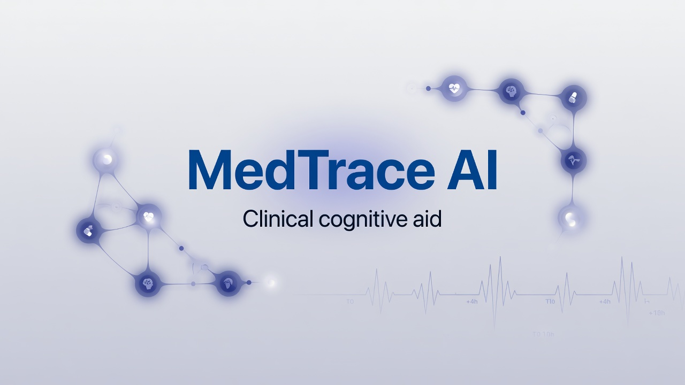
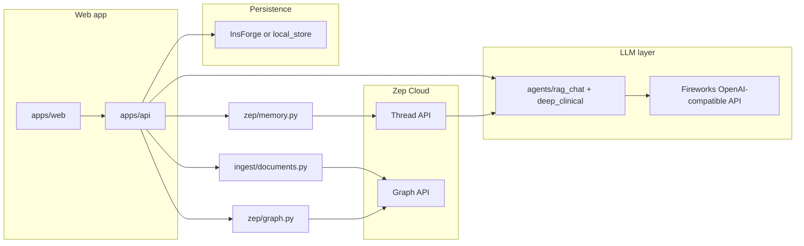
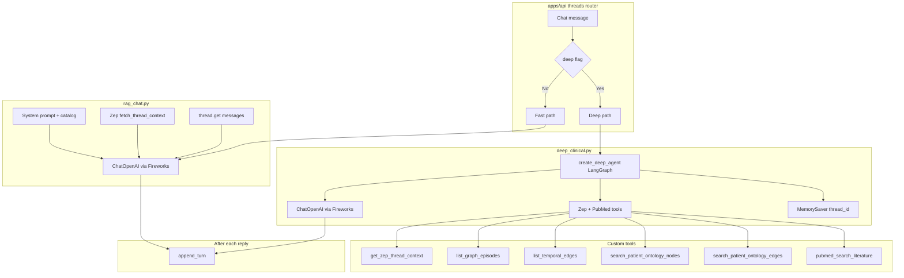
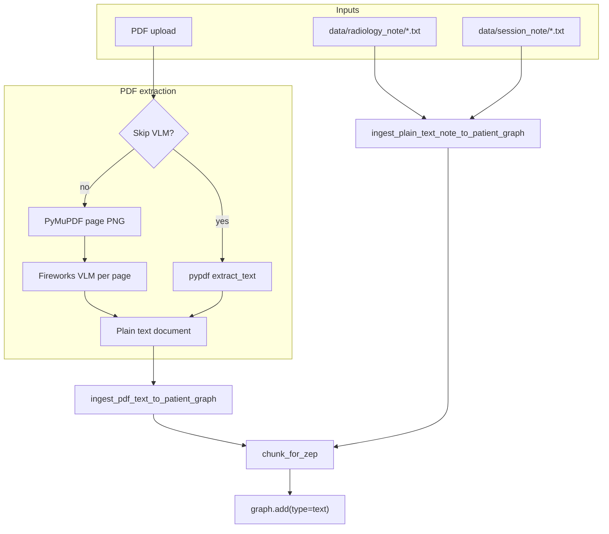

<p align="center">
  
</p>

# MedTrace AI

**Clinical decision support / cognitive aid** — surfaces patterns, timelines, and test ideas for the clinician to validate. Not a certified medical device; agent and vision-ingest output are demo-grade.

One FastAPI service and one React app, sharing the `src/medtrace_agent/` Python package (`medtrace-agent` 0.2.0).

<p align="center">
  <a href="#status-at-a-glance"></a>
  <a href="pyproject.toml"></a>
  <a href="apps/api"></a>
  <a href="apps/web"></a>
  <a href="#sponsors--inference-stack"></a>
  <a href="#local-mock-mode"></a>
</p>

**Topics:** clinical AI · long-term memory · temporal knowledge graph · PDF vision ingest · DICOM imaging · voice consultation · human-in-the-loop review

---

## Contents

- [Status at a glance](#status-at-a-glance)
- [Product surfaces](#product-surfaces)
- [Quick start](#quick-start)
- [Sponsors & inference stack](#sponsors--inference-stack)
- [Monorepo layout](#monorepo-layout)
- [Architecture](#architecture)
- [Zep: thread vs graph](#zep-thread-vs-graph)
- [Chat turn sequence](#chat-turn-sequence)
- [Document ingestion](#document-ingestion)
- [Module map](#module-map)
- [Configuration](#configuration)
- [MedGemma fine-tuning in Colab](#medgemma-fine-tuning-in-colab)
- [Tests](#tests)
- [Dependency highlights](#dependency-highlights)
- [Security & hygiene](#security--hygiene)
- [Related worktrees & branches](#related-worktrees--branches)
- [License](#license)

---

## Status at a glance

| Area | State | Notes |
|------|--------|--------|
| Clinical dashboard (`/`, `/patients/:id`) | **Implemented** | Patients, documents, chat threads, derived clinical views |
| Imaging (`/imaging`) | **Implemented** | DICOM upload, multi-slice/Cornerstone viewer path, MedSAM2, draft reports — **mock without secrets** |
| Voice session (`/session`) | **Prototype** | Needs `npm run dev:transcription` (ports 8010 + 4000) |
| Local mock (`MEDTRACE_LOCAL_MOCK=1`) | **Implemented** | File-backed InsForge stand-in; chat/ingest still need LLM + Zep keys |
| Sponsor inference (AMD / HF / vLLM / Fireworks) | **Documented path** | App talks OpenAI-compatible HTTP; Fireworks default or Spaces/vLLM |
| MedGemma Colab fine-tune | **Implemented** | `notebooks/finetune_medgemma_colab.ipynb` + helper script |
| Certified medical device | **Out of scope** | Educational / demo CDS only |

---

## Product surfaces

| Surface | Path | Port | Role |
|---------|------|------|------|
| **API** (clinical + imaging) | `apps/api/` (`apps.api.main:app`) | **8001** | Patients, documents, chat, derived clinical views, DICOM/imaging |
| **Web** | `apps/web/` — `/`, `/patients/:id`, `/imaging`, `/session` | **3000** | Dashboard, imaging viewer, voice session |
| **Voice prototype** | `services/transcription/` (optional; backs `/session`) | **8010** + **4000** | LangGraph backend + CopilotKit runtime |

- **Clinical** — patients, documents, chat threads, and derived views over **Zep Cloud** (memory + temporal graph), **Fireworks AI** (LLM + VLM), and **InsForge** (Postgres + Storage). Needs keys, or set `MEDTRACE_LOCAL_MOCK=1` for an offline file-backed data layer.
- **Imaging** — DICOM upload, MedSAM2 segmentation, draft reports. **Runs fully in mock mode with no secrets** — easiest path to an end-to-end demo.

---

## Quick start

```bash
python -m venv .venv
.venv/bin/pip install -e ".[dev,imaging]"

npm install
npm --prefix apps/web ci

cp .env.example .env
# Fill ZEP / FIREWORKS / INSFORGE keys, or set MEDTRACE_LOCAL_MOCK=1 for an offline dashboard.
# Imaging works without secrets (deterministic mock).

npm run dev          # api :8001, web :3000
```

| Script | Starts |
|--------|--------|
| `npm run dev` | api + web |
| `npm run dev:api` | FastAPI only |
| `npm run dev:web` | Vite only |
| `npm run dev:transcription` | voice backend (8010) + CopilotKit runtime (4000) |
| `npm run lint` / `npm run build` | TypeScript check / Vite build (`apps/web`) |
| `npm run test:py` | `.venv/bin/pytest -m "not integration"` |

Health check: `curl http://127.0.0.1:8001/api/health`  
Web (Vite binds IPv6 `localhost`): `curl http://localhost:3000`

**Windows (PowerShell):** use `.venv\Scripts\pip.exe` / `.venv\Scripts\uvicorn.exe` if Unix-style `.venv/bin/...` scripts fail under `npm run dev:api`.

---

## Sponsors & inference stack

This project highlights an inference stack built with **sponsor** technologies, plus the product partners that power memory, serverless LLM defaults, and durable storage.

<p align="center">
  <a href="https://www.amd.com/"></a>
  &nbsp;&nbsp;&nbsp;&nbsp;
  <a href="https://huggingface.co/"></a>
  &nbsp;&nbsp;&nbsp;&nbsp;
  <a href="https://docs.vllm.ai/en/latest/"></a>
  &nbsp;&nbsp;&nbsp;&nbsp;
  <a href="https://fireworks.ai/"></a>
  &nbsp;&nbsp;&nbsp;&nbsp;
  <a href="https://www.getzep.com/"></a>
  &nbsp;&nbsp;&nbsp;&nbsp;
  <a href="https://insforge.dev/"></a>
</p>

### What each sponsor / partner does in MedTrace

| Partner | Logo | Role in this repo | Why it matters |
|---------|------|-------------------|----------------|
| **[AMD](https://www.amd.com/)** |  | **GPU acceleration for fine-tuning** custom clinical models (e.g. MedGemma QLoRA in Colab) and for **high-throughput inference** when serving checkpoints | Sponsor compute path for training and production-style serving |
| **[Hugging Face](https://huggingface.co/)** |  | Model artifacts, hub distribution, gated MedGemma access, optional private adapter publish, and **[Spaces](https://huggingface.co/docs/hub/spaces)** for OpenAI-compatible endpoints | Weights + evaluation tooling live on the Hub |
| **[vLLM](https://docs.vllm.ai/en/latest/)** | [docs](https://docs.vllm.ai/en/latest/) | Self-hosted **[OpenAI-compatible server](https://docs.vllm.ai/en/latest/serving/openai_compatible_server/)** (`/v1/chat/completions`) so **`ChatOpenAI`** works without a vendor-specific SDK | Drop-in replacement for Fireworks when pointing env vars at a Space or private host |
| **[Fireworks AI](https://fireworks.ai/)** | [site](https://fireworks.ai/) | **Default** serverless OpenAI-compatible chat + vision (`FIREWORKS_*` in `.env.example`) | Fastest path to a working clinical chat + PDF vision demo |
| **[Zep Cloud](https://www.getzep.com/)** | [site](https://www.getzep.com/) | Long-term **thread** memory + temporal **knowledge graph** (episodes, ontology, facts) | Patient-scoped context for RAG chat and Deep Agent tools |
| **[InsForge](https://insforge.dev/)** | [site](https://insforge.dev/) | Durable document registry, app metadata, and Storage; **or** `MEDTRACE_LOCAL_MOCK=1` file store | Charts/documents without mirroring clinical facts in SQL |

Chat and **PDF page vision** both target the same style of endpoint: **Fireworks** by default, or a **Hugging Face Space** / host running **vLLM** (often on **AMD** hardware).

Authentication is **optional** when your Space or gateway does not require a key; add a bearer token or API key only if your deployment enforces it (see [Configuration](#configuration)).

### Stack badges (core runtime)

<p align="left">
  
  &nbsp;
  
  &nbsp;
  
  &nbsp;
  
</p>

---

## Monorepo layout

```
apps/
  api/               FastAPI — clinical + imaging (8001)
  web/               React/Vite UI — dashboard, imaging, session (3000)
services/
  transcription/     Voice/CopilotKit prototype (8010, 4000)
src/medtrace_agent/  Shared package (Zep, ingest, agents, imaging, InsForge, ontology)
tests/               Pytest suite (covers the shared package)
migrations/          InsForge SQL migrations
mock/patient_data/   Synthetic patient fixtures (local-mock seed source)
data/                Runtime data (local_mock, notes, studies; mostly gitignored)
notebooks/           Colab workflows (MedGemma QLoRA training + evaluation)
scripts/             Ontology apply, note ingest, seeding, local-mock reset, model probe
docs/assets/         README banner, sponsor logos, documentation media
```

---

## Architecture


```mermaid
flowchart LR
  subgraph ui [Web app]
    WEB[apps/web]
    API[apps/api]
  end
  subgraph llm [LLM layer]
    AG[agents/rag_chat + deep_clinical]
    FW[Fireworks OpenAI-compatible API]
  end
  subgraph zep [Zep Cloud]
    TH[Thread API]
    GR[Graph API]
  end
  subgraph persist [Persistence]
    IF[InsForge or local_store]
  end
  WEB --> API
  API --> AG
  AG --> FW
  API --> ZM[zep/memory.py]
  API --> ZG[zep/graph.py]
  API --> DOC[ingest/documents.py]
  API --> IF
  ZM --> TH
  DOC --> GR
  ZG --> GR
  TH --> AG
```

- **Web** talks only to port 3000; Vite proxies `/api` and `/data` to the API, and `/api/copilotkit` to the transcription runtime.
- **Agent** — default `chat_with_memory` (one LLM call with Zep context + document catalog). Optional Deep Agent (`deep` flag) uses Zep tools + PubMed.
- **Zep** — conversational turns on **threads**; durable episodes/facts/ontology on the **user graph**.
- **InsForge** — chart/document/session rows only. Clinical dashboard fields are derived per request from Zep (no SQL mirror). Local mock fakes InsForge via `data/local_mock/`.

### LLM layer

Every chat and PDF-vision call goes through `fireworks_chat_client()` (`medtrace_agent.fireworks_config`) against an **OpenAI-compatible** endpoint — **Fireworks AI** by default (`FIREWORKS_BASE_URL`, `FIREWORKS_MODEL`, `FIREWORKS_VL_MODEL`).

- `FIREWORKS_VLM_API` — `chat` (`/v1/chat/completions`, default) or `completions` (`<image>`-prompt style).
- `FIREWORKS_REASONING_EFFORT=none` — keeps Qwen3-style CoT out of `reasoning_content` so JSON/text lands in `content`.
- Any OpenAI-compatible host works if you repoint those env vars (including a self-hosted [vLLM](https://docs.vllm.ai/en/latest/serving/openai_compatible_server/) server on **AMD** / **Hugging Face Spaces**).

Fireworks retires serverless model ids often; a stale id fails as `404 Model not found`, not auth. Run `scripts/fireworks_probe_models.py` to list what your key can reach.

### AI agent paths

How the API chooses between **fast RAG chat** and the **Deep Clinical Agent** (`deep` on `POST /api/threads/{id}/messages`):


```mermaid
flowchart TB
  subgraph ui [apps/api threads router]
    toggle{deep flag}
    chatIn[Chat message] --> toggle
    toggle -->|No| fastPath[Fast path]
    toggle -->|Yes| deepPath[Deep path]
  end

  subgraph fastAgent [rag_chat.py]
    SYS1[System prompt + catalog]
    CTX1[Zep fetch_thread_context]
    HIST1[thread.get messages]
    LLM1[ChatOpenAI via Fireworks]
    fastPath --> LLM1
    SYS1 --> LLM1
    CTX1 --> LLM1
    HIST1 --> LLM1
  end

  subgraph deepAgent [deep_clinical.py]
    DA[create_deep_agent LangGraph]
    TOOLS[Zep + PubMed tools]
    LLM2[ChatOpenAI via Fireworks]
    CP[MemorySaver thread_id]
    deepPath --> DA
    DA --> LLM2
    DA --> TOOLS
    DA --> CP
  end

  subgraph toolList [Custom tools]
    T1[get_zep_thread_context]
    T2[list_graph_episodes]
    T3[list_temporal_edges]
    T4[search_patient_ontology_nodes]
    T5[search_patient_ontology_edges]
    T6[pubmed_search_literature]
    TOOLS --> T1 & T2 & T3 & T4 & T5 & T6
  end

  subgraph persist [After each reply]
    AT[append_turn]
    LLM1 --> AT
    LLM2 --> AT
  end
```

| Path | Role |
|------|------|
| **Fast** | Single `chat_with_memory` call: system prompt + Zep context + recent messages + document catalog. No tool loop. |
| **Deep** | `create_deep_agent` with Zep graph tools + PubMed (`integrations/pubmed` via NCBI E-utilities). Slower; educational demo only. |
| **PubMed** | Set `NCBI_EMAIL` (and optionally `NCBI_API_KEY`) for reliable E-utilities access. |

### Imaging

`MedSAM2Service` / report adapters resolve in order: **HTTP endpoint** → **local adapter** → **deterministic mock**. Reports use Qwen VL via Nebius when `NEBIUS_API_KEY` is set; otherwise mock. DICOM previews use pydicom with rescale + windowing; ROI prompts are normalized 0–1 and converted to pixels server-side. Multi-slice series support and Cornerstone-based viewing live under `apps/web` imaging components and `apps/api` studies routes.

Sample DICOM for uploads (ships with pydicom):

```bash
.venv/bin/python -c "import pydicom.data,os;print(os.path.join(os.path.dirname(pydicom.data.__file__),'test_files','MR_small.dcm'))"
```

### Local mock mode

`MEDTRACE_LOCAL_MOCK=1` runs the dashboard **without InsForge**:

- Persistence routes to `local_store` (`data/local_mock/store.json`), auto-seeded from `mock/patient_data/`.
- Reset with `scripts/reset_local_mock.py`.
- **Chat and ingest still need Zep + Fireworks** — only the InsForge layer is faked.

---

## Zep: thread vs graph

A patient is a Zep **user** (`zep_user_id`).

### Thread (short dialog + rolling context)

- `thread.get_user_context(thread_id)` — synthesized context for the model.
- `thread.get(thread_id, lastn=…)` — recent messages for LangChain history.
- `thread.add_messages` — appends user + assistant turns after each reply.

New thread = new conversation, same user (long-term recall stays attached to the patient).

### Graph (episodes, facts, ontology)

- `graph.add` — PDF/note chunks as text episodes (metadata: `doc_id`, filename, `kind`, …).
- `graph.set_ontology` — clinical entity/edge types (`AUTO_APPLY_ZEP_ONTOLOGY=true` at API startup).
- `graph.search` / episode + edge APIs — power derived clinical views and Deep Agent tools.

**Ontology is a startup dependency.** If registration is skipped, clinical endpoints return empty arrays with 200. Re-apply with `scripts/apply_ontology.py`.

---

## Chat turn sequence

1. User sends a message in the web app.
2. `fetch_thread_context(thread_id)` → Zep context string + last N messages.
3. Document catalog is built from the InsForge / local-mock registry for that patient.
4. **Default:** `chat_with_memory` — one LLM call. **Deep:** `run_clinical_deep_agent_turn` with tools + `MemorySaver`.
5. `append_turn` writes both sides to Zep via `thread.add_messages`.

---

## Document ingestion

**Default (vision):** each PDF page is rasterized (PyMuPDF) and sent to the Fireworks multimodal model; JSON is validated then serialized to plain text.

**Skip VLM:** `pypdf` reads the embedded text layer only — faster, but no scans/handwriting.

Then chunks go to Zep via `chunk_for_zep` → `graph.add(type="text")`.


```mermaid
flowchart TB
  subgraph inputs [Inputs]
    PDF[PDF upload]
    RAD[data/radiology_note/*.txt]
    SESS[data/session_note/*.txt]
  end

  subgraph pdfPath [PDF extraction]
    PDF --> mode{Skip VLM?}
    mode -->|no| raster[PyMuPDF page PNG]
    raster --> vm[Fireworks VLM per page]
    vm --> unified[Plain text document]
    mode -->|yes| pypdf[pypdf extract_text]
    pypdf --> unified
  end

  unified --> ingest[ingest_pdf_text_to_patient_graph]
  RAD & SESS --> notes[ingest_plain_text_note_to_patient_graph]
  ingest & notes --> chunk[chunk_for_zep]
  chunk --> gadd["graph.add(type=text)"]
```

| Source | Typical `kind` | Chunk header |
|--------|----------------|--------------|
| PDF (VLM or Skip VLM) | `pdf_medical_history` | `[ClinicalDocument …]` |
| `data/radiology_note/*.txt` | `radiology_note` | `[RadiologyNote …]` |
| `data/session_note/*.txt` | `session_note` | `[SessionNote …]` |

**Cost:** one multimodal call per page. Cap with `PDF_VL_MAX_PAGES` (default 25) / `PDF_VL_DPI` (default 150), or the upload form's `dpi` / `max_pages`. Vision models can misread numbers or hallucinate fields — treat as demo-grade.

---

## Module map

| Module | Role |
|--------|------|
| `apps/api/routers/threads.py` | Chat turn → fast or deep path, then `append_turn` |
| `apps/api/routers/clinical.py` | Conditions, meds, labs, alerts, timeline from Zep |
| `apps/api/routers/studies.py` | DICOM upload, segmentation, draft reports |
| `medtrace_agent.agents.rag_chat` | `chat_with_memory` — single LLM call |
| `medtrace_agent.agents.deep_clinical` | Deep Agent + Zep/PubMed tools |
| `medtrace_agent.zep.memory` / `zep.graph` | Thread lifecycle + graph inspector |
| `medtrace_agent.ingest.documents` / `scan_extract` | PDF/note → Zep graph |
| `medtrace_agent.ontology.clinical` | Entity/edge ontology; auto-applied at startup |
| `medtrace_agent.insforge_api` / `local_store` | InsForge registry + local-mock twin |
| `medtrace_agent.fireworks_config` | Sole `ChatOpenAI` construction point |
| `medtrace_agent.imaging.*` | Study paths, DICOM preview, MedSAM2 / report adapters |

---

## Configuration

See **`.env.example`** for every variable. Comments must be on their own lines — dotenv treats trailing `# ...` as part of the value.

| Area | Variables |
|------|-----------|
| **LLM** | `FIREWORKS_API_KEY`, `FIREWORKS_BASE_URL`, `FIREWORKS_MODEL`, `FIREWORKS_VL_MODEL`, `FIREWORKS_VLM_API`, `FIREWORKS_REASONING_EFFORT` |
| **Memory** | `ZEP_API_KEY`, `AUTO_APPLY_ZEP_ONTOLOGY` |
| **Persistence** | `INSFORGE_URL`, `INSFORGE_ANON_KEY`, `INSFORGE_API_KEY`, `INSFORGE_PROFILE_ID` — or `MEDTRACE_LOCAL_MOCK=1` |
| **PDF caps** | `PDF_VL_MAX_PAGES`, `PDF_VL_DPI` |
| **PubMed** | `NCBI_EMAIL`, `NCBI_API_KEY` (optional) |
| **Voice `/session`** | `GEMINI_API_KEY` (transcription); `OPENAI_*` for report agent / TTS (can point at Fireworks for chat) |
| **CORS** | `API_CORS_ORIGINS` (defaults include localhost:3000) |

Clinical data routes return **503** without InsForge or local mock. Imaging routes never do (they degrade to mock). Chat/ingest fail without Fireworks + Zep even in local-mock mode.

---

## MedGemma fine-tuning in Colab

[`notebooks/finetune_medgemma_colab.ipynb`](notebooks/finetune_medgemma_colab.ipynb) runs a reproducible QLoRA SFT workflow for `google/medgemma-4b-it` on an A100 Colab runtime. The notebook calls [`scripts/finetune_medgemma_colab.py`](scripts/finetune_medgemma_colab.py), which:

- loads a Hugging Face `DatasetDict`, a local/Drive `save_to_disk()` dataset, or JSON/JSONL;
- requires `image`, `prompt`, and clinician-reviewed `response` columns;
- uses an existing validation split or creates a deterministic patient/study-level split via `patient_id` (configurable);
- logs losses and aggregate base-vs-tuned evaluation metrics to W&B;
- keeps raw evaluation prompts and predictions out of W&B unless explicitly enabled;
- saves the LoRA adapter locally and optionally publishes it to a private Hugging Face repository only when the configured evaluation gates pass.

Add `HF_TOKEN` and `WANDB_API_KEY` through Colab Secrets; never paste them into the notebook. MedGemma is gated, so accept its Hugging Face usage terms before starting. For report tuning, each `response` should be JSON containing `summary`, `findings`, `impression`, `recommendation`, and numeric `confidence`.

The included ROUGE, exact-match, JSON-validity, and loss checks are engineering signals—not clinical validation. Use de-identified data and add clinician-reviewed task metrics, subgroup analysis, calibration, and failure-mode review before promoting a model.

Training acceleration and high-throughput serving for these workflows align with the **AMD** / **Hugging Face** / **vLLM** sponsor path described above.

---

## Tests

```bash
.venv/bin/pytest -m "not integration"   # or: npm run test:py
.venv/bin/pytest tests/unit/test_rag_chat.py
```

Tests cover `src/medtrace_agent/` only — `apps/api/` has none; verify API changes with the running service. The `integration` marker hits the live NCBI PubMed API.

---

## Dependency highlights

- **zep-cloud** — thread + graph APIs
- **langchain-openai** / **deepagents** — `ChatOpenAI` + Deep Agent path
- **fastapi** / **uvicorn** — `apps/api`
- **pypdf** / **pymupdf** / **pydantic** — PDF extract + VLM JSON validation
- **pydicom** / **numpy** / **pillow** — imaging extra (`pip install -e ".[imaging]"`)
- **vLLM** (inference server, optional) — OpenAI-compatible serving on Spaces / AMD-backed hosts (see [Sponsors & inference stack](#sponsors--inference-stack))

---

## Security & hygiene

- Never commit `.env` or secrets. `INSFORGE_API_KEY` is server-side only.
- `data/` (studies, local mock, uploaded notes) is largely gitignored — do not commit real PHI. Fixtures in `mock/patient_data/` are synthetic.
- Do not widen CORS to `*` for the main API.
- Agent output is non-diagnostic clinical decision support, not a medical device.

---

## Related worktrees & branches

Other local worktrees may track experimental or PR-scoped work (e.g. Medplum FHIR clinical-core demos). Those are **not** required for the default stack above.

| Focus | Notes |
|-------|--------|
| This tree / `main` | Consolidated API + web + local mock + imaging/session + MedGemma Colab |
| Medplum-oriented branches | Document FHIR R4 as the clinical store — **different** architecture from this README |

---

## License

No license file is currently checked in. Treat the repository as proprietary / all-rights-reserved unless a `LICENSE` is added.
