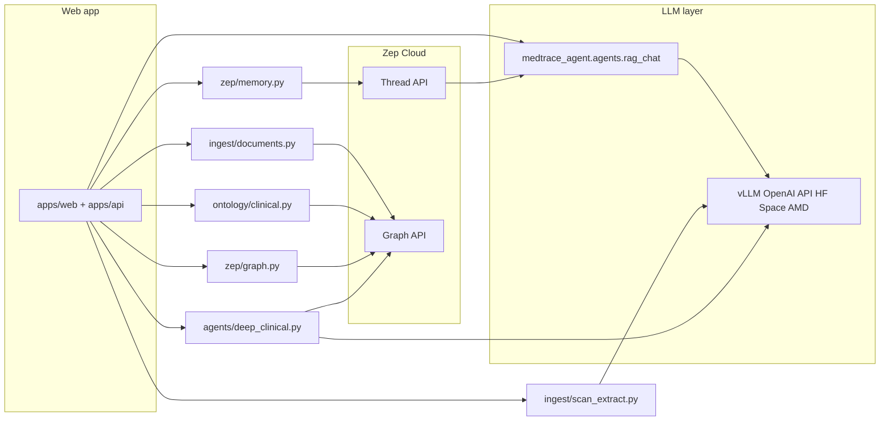
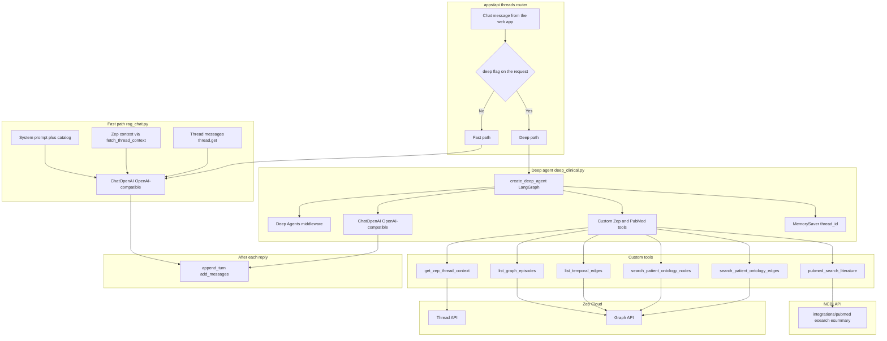
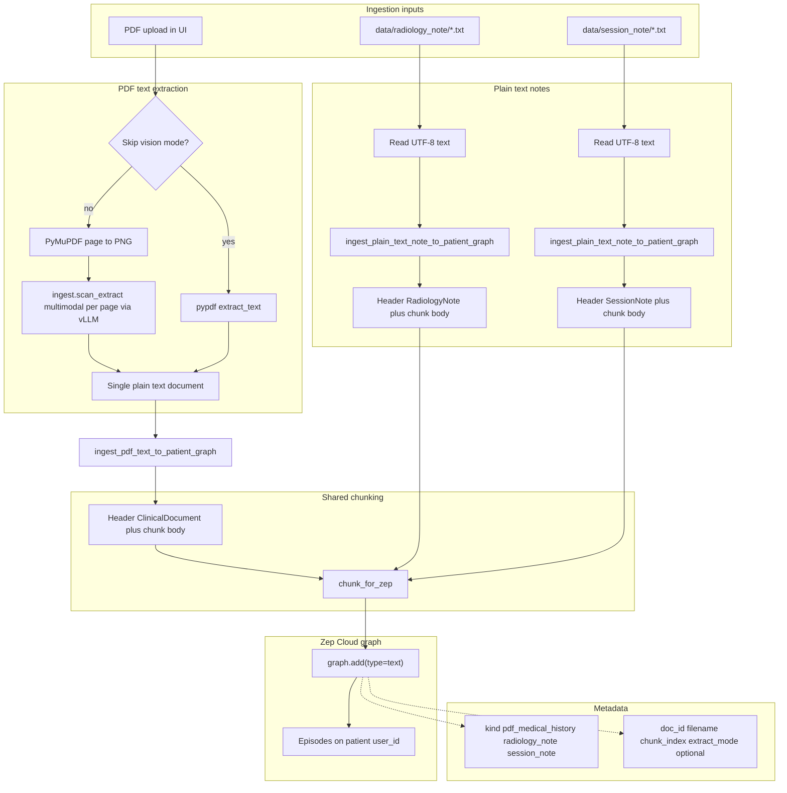

<p align="center">
  
</p>

# MedTrace AI

**“clinical decision support” or “cognitive aid”**: not replacing the doctor, but surfacing **patterns, timelines, and test ideas** the clinician still validates.

> Demo / educational project — **not** a certified medical device. Agent and vision-ingest output are demo-grade cognitive aids.

<p align="center">
  <a href="#status-at-a-glance"></a>
  <a href="pyproject.toml"></a>
  <a href="apps/api"></a>
  <a href="apps/web"></a>
  <a href="#sponsors--inference-stack"></a>
  <a href="#running-minimal"></a>
</p>

**Topics:** clinical AI · long-term memory · temporal knowledge graph · PDF vision ingest · DICOM imaging · voice consultation · human-in-the-loop review

---

## Contents

- [Status at a glance](#status-at-a-glance)
- [Product surfaces](#product-surfaces)
- [Monorepo layout & running everything](#monorepo-layout--running-everything)
- [Sponsors & inference stack](#sponsors--inference-stack)
- [Architecture](#architecture)
- [LLM model](#llm-model)
- [High-level picture](#high-level-picture)
- [AI agent architecture](#ai-agent-architecture)
- [Repository layout](#repository-layout)
- [Module responsibilities](#module-responsibilities)
- [Zep: thread vs graph](#zep-thread-vs-graph)
- [Chat turn sequence](#chat-turn-sequence)
- [PDF ingest sequence](#pdf-ingest-sequence)
- [Document ingestion architecture](#document-ingestion-architecture)
- [Vision ingest risks](#vision-ingest-risks)
- [Session state (important caveats)](#session-state-important-caveats)
- [Configuration](#configuration)
- [Running (minimal)](#running-minimal)
- [Dependency stack](#dependency-stack)
- [Related worktrees & branches](#related-worktrees--branches)
- [License](#license)

---

## Status at a glance

| Area | State | Notes |
|------|--------|--------|
| Clinical dashboard (`/`, `/patients/:id`) | **Implemented** | Patients, documents, chat threads, derived clinical views |
| Imaging (`/imaging`) | **Implemented** | DICOM upload, MedSAM2 segmentation, draft reports — **mock without secrets** |
| Voice session (`/session`) | **Prototype** | Needs `npm run dev:transcription` (ports 8010 + 4000) |
| Local mock (`MEDTRACE_LOCAL_MOCK=1`) | **Implemented** | File-backed InsForge stand-in; chat/ingest still need LLM + Zep keys |
| Sponsor inference (AMD / HF / vLLM) | **Documented path** | App talks OpenAI-compatible HTTP; Fireworks or Spaces work interchangeably |
| Certified medical device | **Out of scope** | Educational / demo CDS only |

---

## Product surfaces

| Surface | Path | Port | Role |
|---------|------|------|------|
| **API** | `apps/api/` (`apps.api.main:app`) | **8001** | Clinical + imaging in one FastAPI service |
| **Web** | `apps/web/` | **3000** | Dashboard, imaging viewer, voice session |
| **Transcription** | `services/transcription/` | **8010** + **4000** | Optional LangGraph + CopilotKit prototype for `/session` |

Shared Python package: `src/medtrace_agent/` (installable as **`medtrace-agent`**).

---

## Monorepo layout & running everything

One FastAPI service and one React app, sharing the `src/medtrace_agent/` Python package:

- **`apps/api/`** (port 8001) — clinical routes (patients, documents, chat threads, derived
  clinical views over Zep) **and** imaging routes (DICOM upload, MedSAM2 segmentation, draft
  reports). Imaging works with no secrets at all; clinical needs keys or local-mock mode.
- **`apps/web/`** (port 3000) — one app, three routes: `/` + `/patients/:id` (dashboard),
  `/imaging` (DICOM viewer), `/session` (voice consultation).

`services/transcription/` is a preserved prototype backing the `/session` route and starts
separately. Other folders: `migrations/`, `mock/`, `scripts/`, `tests/`.

### One command for the whole dev environment

```bash
# Python: shared venv used by the API, the scripts and the tests
python -m venv .venv
.venv/bin/pip install -e ".[dev,imaging]"

# Node
npm install
npm --prefix apps/web ci

# Copy env. Clinical features need ZEP/FIREWORKS/INSFORGE keys; imaging runs mock without any.
# For a fully offline dashboard, set MEDTRACE_LOCAL_MOCK=1 instead.
cp .env.example .env

npm run dev          # api on 8001, web on 3000
```

**Windows (PowerShell) notes:** use `.venv\Scripts\pip.exe` and `.venv\Scripts\uvicorn.exe` if `npm run dev:api` fails on Unix-style `.venv/bin/...` paths. Vite binds **`localhost` (IPv6)** — open `http://localhost:3000`, not only `127.0.0.1`.

Other scripts: `npm run dev:api`, `npm run dev:web`, `npm run dev:transcription`,
`npm run lint`, `npm run build`, `npm run test:py`.

---

## Sponsors & inference stack

This project highlights an inference stack built with **sponsor** technologies, plus the product partners that power memory, serverless LLM defaults, and durable storage in the monorepo.

<p align="center">
  <a href="https://www.amd.com/"></a>
  &nbsp;&nbsp;&nbsp;&nbsp;
  <a href="https://huggingface.co/"></a>
  &nbsp;&nbsp;&nbsp;&nbsp;
  <a href="https://docs.vllm.ai/en/latest/"></a>
  &nbsp;&nbsp;&nbsp;&nbsp;
  <a href="https://www.getzep.com/"></a>
  &nbsp;&nbsp;&nbsp;&nbsp;
  <a href="https://fireworks.ai/"></a>
  &nbsp;&nbsp;&nbsp;&nbsp;
  <a href="https://insforge.dev/"></a>
</p>

### What each sponsor / partner does in MedTrace

| Partner | Logo | Role in this repo | Why it matters |
|---------|------|-------------------|----------------|
| **[AMD](https://www.amd.com/)** |  | **GPU acceleration for fine-tuning** our **custom** clinical models and for **high-throughput inference** when serving checkpoints | Sponsor compute path for MedGemma-class models and production-style serving |
| **[Hugging Face](https://huggingface.co/)** |  | Model artifacts, hub distribution, and **[Spaces](https://huggingface.co/docs/hub/spaces)** deployment for the **OpenAI-compatible** endpoints this app calls | Weights live on the Hub; Spaces host the OpenAI-style API the agents call |
| **[vLLM](https://docs.vllm.ai/en/latest/)** | [docs](https://docs.vllm.ai/en/latest/) | We serve models behind LangChain using vLLM’s **[OpenAI-compatible server](https://docs.vllm.ai/en/latest/serving/openai_compatible_server/)** (`/v1/chat/completions` and related routes), so **`ChatOpenAI`** works without a vendor-specific SDK | One HTTP shape for chat + multimodal PDF page vision |
| **[Zep Cloud](https://www.getzep.com/)** | [site](https://www.getzep.com/) | Long-term **thread** memory + temporal **knowledge graph** (episodes, ontology, facts) | Patient-scoped context for RAG chat and Deep Agent tools |
| **[Fireworks AI](https://fireworks.ai/)** | [site](https://fireworks.ai/) | Default **OpenAI-compatible** serverless chat + vision keys in `.env.example` (`FIREWORKS_*`) when not pointing at a HF Space | Fast local demo path without self-hosting vLLM |
| **[InsForge](https://insforge.dev/)** | [site](https://insforge.dev/) | Durable document registry, app metadata, and Storage; **or** `MEDTRACE_LOCAL_MOCK=1` file store | Charts/documents without mirroring clinical facts in SQL |

Chat and **PDF page vision** (multimodal messages for structured extraction) both target the same style of endpoint: a **Hugging Face Space** (or compatible host) running **vLLM** on **AMD** hardware.

Authentication for those endpoints is **optional** whenever your Space or gateway does not require a key; add a bearer token or API key only if your deployment enforces it (see [Configuration](#configuration)).

### Inference path (sponsor stack)

```text
Clinician UI (apps/web)
        │
        ▼
FastAPI (apps/api)  ──►  medtrace_agent agents / ingest
        │                         │
        │                         ├── ChatOpenAI ──► OpenAI-compatible /v1
        │                         │                      │
        │                         │         ┌────────────┴────────────┐
        │                         │         ▼                         ▼
        │                         │   HF Space + vLLM on AMD    Fireworks serverless
        │                         │
        └── Zep threads + graph ◄─┘
            InsForge / local_mock registry
```

### Stack badges (core runtime)

<p align="left">
  
  &nbsp;
  
  &nbsp;
  
  &nbsp;
  
</p>

---

# Architecture

Clinical demo that combines **Zep Cloud** (long-term memory + temporal knowledge graph) with **`ChatOpenAI`** pointed at an **OpenAI-compatible** endpoint. The **custom** [**MedGemma 1.5 4B IT (GGUF)**](https://huggingface.co/gguf-org/medgemma-1.5-4b-it-gguf) checkpoint (`gguf-org/medgemma-1.5-4b-it-gguf` on Hugging Face) is **fine-tuned** on **AMD** GPUs; we **deploy** inference on **[Hugging Face Spaces](https://huggingface.co/docs/hub/spaces)** behind **[vLLM’s OpenAI-compatible server](https://docs.vllm.ai/en/latest/serving/openai_compatible_server/)** for both chat and multimodal PDF ingest. Details: [LLM model](#llm-model) and [Sponsors & inference stack](#sponsors--inference-stack).

## LLM model

Clinical chat and agents use **`ChatOpenAI`** against the **OpenAI-compatible** base URL and model id you configure (names and defaults live in **`.env.example`**).

- **Weights:** [gguf-org/medgemma-1.5-4b-it-gguf](https://huggingface.co/gguf-org/medgemma-1.5-4b-it-gguf) on **Hugging Face** (GGUF packaging for efficient serving).
- **Fine-tuning:** performed using **AMD** GPU infrastructure (sponsor).
- **Deployment:** models are served from a **[Hugging Face Space](https://huggingface.co/docs/hub/spaces)** running **[vLLM](https://docs.vllm.ai/en/latest/)** with the **[OpenAI-compatible HTTP API](https://docs.vllm.ai/en/latest/serving/openai_compatible_server/)**; point the app’s base URL and model id at that Space (or equivalent endpoint).
- **PDF vision ingest:** each page image is sent to a **multimodal-capable** model using the same OpenAI-style **`/v1/chat/completions`** flow (see vLLM docs on multimodal serving); configure the vision base URL, model id, and API mode in **`.env.example`**. Pure text checkpoints do not replace the vision ingest path unless you use text-only extraction in the UI (pass `extract_mode=pypdf` on the document upload route for text-only extraction).

## High-level picture


```mermaid
flowchart LR
  subgraph ui [Web app]
    APP[apps/web + apps/api]
  end
  subgraph llm [LLM layer]
    AG[medtrace_agent.agents.rag_chat]
    FW[vLLM OpenAI API HF Space AMD]
  end
  subgraph zep [Zep Cloud]
    TH[Thread API]
    GR[Graph API]
  end
  APP --> AG
  AG --> FW
  APP --> ZM[zep/memory.py]
  APP --> ZG[zep/graph.py]
  APP --> DOC[ingest/documents.py]
  APP --> SCAN[ingest/scan_extract.py]
  APP --> ONTO[ontology/clinical.py]
  APP --> DCA[agents/deep_clinical.py]
  ZM --> TH
  DOC --> GR
  SCAN --> FW
  ONTO --> GR
  ZG --> GR
  TH --> AG
  DCA --> FW
  DCA --> GR
```


- **UI** owns session state (patient id, thread id, ingested-document registry, chat history).
- **Agent** — default **`chat_with_memory`** builds the system prompt (Zep context + optional document catalog) and calls the LLM once. Optional **Clinical reasoning (Deep Agent)** uses **`medtrace_agent.agents.deep_clinical`** (`create_deep_agent`) with Zep tools + PubMed (`integrations/pubmed`).
- **Zep** stores conversational turns on **threads** and structured memories / episodes on the **user graph** (PDF chunks, extracted facts, ontology-backed nodes).

## AI agent architecture

How the API chooses between the **fast RAG chat** and the **Deep Clinical Agent** (the `deep` flag on `POST /api/threads/{id}/messages`), and how each connects to the configured OpenAI-compatible chat API, Zep, and PubMed.


```mermaid
flowchart TB
  subgraph ui [apps/api threads router]
    toggle{deep flag on the request}
    chatIn[Chat message from the web app]
    chatIn --> toggle
    toggle -->|No| fastPath[Fast path]
    toggle -->|Yes| deepPath[Deep path]
  end

  subgraph fastAgent [Fast path rag_chat.py]
    SYS1[System prompt plus catalog]
    CTX1[Zep context via fetch_thread_context]
    HIST1[Thread messages thread.get]
    LLM1[ChatOpenAI OpenAI-compatible]
    fastPath --> LLM1
    SYS1 --> LLM1
    CTX1 --> LLM1
    HIST1 --> LLM1
  end

  subgraph deepAgent [Deep agent deep_clinical.py]
    DA[create_deep_agent LangGraph]
    HARNESS[Deep Agents middleware]
    TOOLS[Custom Zep and PubMed tools]
    LLM2[ChatOpenAI OpenAI-compatible]
    CP[MemorySaver thread_id]
    deepPath --> DA
    DA --> HARNESS
    DA --> LLM2
    DA --> TOOLS
    DA --> CP
  end

  subgraph toolList [Custom tools]
    T1[get_zep_thread_context]
    T2[list_graph_episodes]
    T3[list_temporal_edges]
    T4[search_patient_ontology_nodes]
    T5[search_patient_ontology_edges]
    T6[pubmed_search_literature]
    TOOLS --> T1
    TOOLS --> T2
    TOOLS --> T3
    TOOLS --> T4
    TOOLS --> T5
    TOOLS --> T6
  end

  subgraph zep [Zep Cloud]
    TH[Thread API]
    GR[Graph API]
    T1 --> TH
    T2 --> GR
    T3 --> GR
    T4 --> GR
    T5 --> GR
  end

  subgraph ncbi [NCBI API]
    EU[integrations/pubmed esearch esummary]
    T6 --> EU
  end

  subgraph persist [After each reply]
    AT[append_turn add_messages]
    LLM1 --> AT
    LLM2 --> AT
  end
```

| Piece | Role |
|--------|------|
| **Fast path** | Single **`chat_with_memory`** call: system prompt + Zep **`thread.get_user_context`** text (via **`fetch_thread_context`**) + recent **`thread.get`** messages + optional ingested-document catalog. **No tool loop.** |
| **Deep path** | **`create_deep_agent`** with the same configured **`ChatOpenAI`**, custom tools for Zep graph + PubMed, **`MemorySaver`** keyed by **`thread_id`**, plus built-in Deep Agents middleware (planning, virtual filesystem, subagents — not shown in detail). |
| **PubMed** | **`medtrace_agent.integrations.pubmed`** — NCBI **E-utilities** (`esearch` / `esummary`) over HTTP JSON, **not** HTML scraping. |

## Repository layout

| Path | Purpose |
|------|---------|
| `pyproject.toml` | Package metadata, dependencies, pytest config (`medtrace-agent`, installable from `src/`). |
| `src/medtrace_agent/` | Importable package: `zep`, `ontology`, `integrations`, `agents`, `ingest`. |
| `apps/api/` | FastAPI service: clinical + imaging routes. |
| `apps/web/` | React app: dashboard, imaging viewer, session route. |
| `tests/` | Pytest suite (`pip install -e ".[dev]"` includes pytest). |
| `data/` | Sample note paths (PDFs/notes gitignored; keep `.gitkeep` where needed). |
| `docs/assets/` | README banner, sponsor logos, and other documentation media. |
| `migrations/` | InsForge SQL migrations (schema, RLS, metadata, demo-mode). |
| `mock/patient_data/` | Synthetic patient JSON fixtures (seed source for local mock). |
| `scripts/` | Ontology apply, note ingest, seeding, local-mock reset, model probe. |
| `services/transcription/` | Voice/CopilotKit prototype for `/session`. |

## Module responsibilities


| Module | Role |
| ------ | ---- |
| `apps/api/routers/threads.py` | Chat turn: Zep context + document catalog → **`chat_with_memory`** or **`run_clinical_deep_agent_turn`** (the `deep` flag), then `append_turn`. |
| `apps/api/routers/clinical.py` | Derives conditions, medications, labs, alerts and timeline from Zep per request — no SQL mirror. |
| `medtrace_agent.agents.rag_chat` | `chat_with_memory(...)`: composes system prompt from base instructions, **Memory context** (`zep_context`), and **Ingested clinical documents** (`document_catalog`). Invokes `ChatOpenAI` against the configured OpenAI-compatible chat endpoint. |
| `medtrace_agent.agents.deep_clinical` | **`create_deep_agent`** (LangChain Deep Agents): Zep tools (`get_zep_thread_context`, episodes, edges, ontology search) + **`pubmed_search_literature`**, **`MemorySaver`** checkpointing keyed by `thread_id`. Non-diagnostic CDS framing. |
| `medtrace_agent.integrations.pubmed` | NCBI **esearch** + **esummary** (JSON) for PubMed titles/PMIDs; uses **`NCBI_EMAIL`** / **`NCBI_API_KEY`** when set. |
| `medtrace_agent.zep.memory` | Zep client singleton; `ensure_user`, `ensure_session` (thread create); `fetch_thread_context` (`thread.get_user_context` + `thread.get` message tail); `append_turn` (`thread.add_messages`). Handles duplicate-user / duplicate-thread `BadRequestError` shapes. |
| `medtrace_agent.zep.graph` | Read-only inspector: episodes by user, temporal edges by user, ontology-scoped `graph.search` for nodes/edges. Returns `list[dict]` rows. |
| `medtrace_agent.ingest.documents` | `pdf_bytes_to_text(...)` (PDF → **`ingest.scan_extract`** vision path or **`pypdf`**). **`ingest_pdf_text_to_patient_graph`**, **`ingest_plain_text_note_to_patient_graph`**, **`ingest_txt_path_to_patient_graph`** for **`data/radiology_note/`** and **`data/session_note/`** `.txt` files. All paths use **`chunk_for_zep`** then **`graph.add`**. |
| `medtrace_agent.ingest.scan_extract` | **`pdf_to_page_images_png`**, **`vl_extract_single_page`** (LangChain `ChatOpenAI` + vision), Pydantic **`PageVLMExtract`**, **`pdf_bytes_via_vlm`** / **`serialize_pages_for_ingest`**. |
| `medtrace_agent.ontology.clinical` | Clinical demo ontology (entity + edge type definitions). `apply_clinical_ontology` calls `graph.set_ontology` (default: project-wide registration so dashboard visibility matches Zep docs). |


## Zep: thread vs graph

Understanding this split is central to the architecture.

### Thread (short dialog + rolling context)

- Identified by `**thread_id**` (the app calls this the “session” in places; Zep SDK uses `thread`).
- `**thread.get_user_context(thread_id)**` returns synthesized context for the model (facts Zep derives from history + graph).
- `**thread.get(thread_id, lastn=…)**` supplies recent messages for LangChain (short-term conversational continuity).
- `**thread.add_messages**` appends the latest user + assistant turns after each reply so Zep can absorb them into memory.

Threads are **per conversation session**; changing “New thread” creates a new id while keeping the same **user** (`zep_user_id`), so long-term recall can still attach to the patient user in Zep.

### Graph (episodes, facts, ontology)

- `**graph.add`** ingests PDF-derived **text** episodes tagged with metadata (`doc_id`, filename, etc.). Zep’s pipeline turns content into episodes and, over time, **temporal edges / facts** visible in the inspector.
- `**graph.set_ontology`** registers custom entity and edge types for extraction (clinical demo schema).
- `**graph.episode.get_by_user_id**` / `**graph.edge.get_by_user_id**` back the derived clinical views and the Deep Agent's graph tools.
- `**graph.search**` powers ontology-filtered lookups in the UI.

The **patient** is modeled as a Zep **user** (`zep_user_id`). All graph reads/writes for that demo patient use this id.

## Chat turn sequence

1. User submits a message in the web app.
2. `**fetch_thread_context(thread_id)`** → `zep_context` string + last N `Message` objects from Zep.
3. `**_format_document_catalog(...)**` builds a bullet list of the patient's registered documents (`doc_id`, filename, kind, episode count).
4. **Chat path** (sidebar):
   - **Default:** `**chat_with_memory**` builds `SystemMessage` + LangChain history + new `HumanMessage`, single LLM call.
   - **Clinical reasoning (Deep Agent):** `**run_clinical_deep_agent_turn**` runs **`create_deep_agent`** with Zep + PubMed tools and LangGraph **`MemorySaver`** (same `thread_id`). Slower; includes Deep Agents planning/filesystem middleware — demo only.
5. Assistant text is shown; optional captions for ingested-doc registry and Deep Agent turns.
6. `**append_turn**` pushes user + assistant strings to Zep via `**thread.add_messages**`.

### Clinical reasoning mode (constraints)

Educational demo only: outputs are **not** a diagnosis or substitute for clinical judgment. PubMed results depend on NCBI availability; set **`NCBI_EMAIL`** (and optionally **`NCBI_API_KEY`**) in `.env` for reliable E-utilities access.

## PDF ingest sequence

**Default (vision):** every PDF is rendered **page-by-page to PNG** with **PyMuPDF** (`fitz`). Each image is sent to the configured **multimodal** model via **`ChatOpenAI`** against a **[vLLM OpenAI-compatible](https://docs.vllm.ai/en/latest/serving/openai_compatible_server/)** endpoint—typically a **[Hugging Face Space](https://huggingface.co/docs/hub/spaces)** on **AMD** GPUs (sponsor stack). The model returns **JSON** (structured clinical fields + **`page_visible_text`** transcript), validated with **Pydantic**, then concatenated into one plain-text document by **`serialize_pages_for_ingest`**.

**Optional fast path (“Skip VLM” in the UI):** `**pdf_bytes_to_text_pypdf`** reads only the embedded text layer (`pypdf`). Cheaper and faster for born-digital PDFs; **does not** read scanned pages, handwriting, or text that exists only inside embedded bitmaps.

Then, for each file:

1. The app assigns a `**doc_id`** and calls `**ingest_pdf_text_to_patient_graph**`, which `**chunk_for_zep**` splits the document and `**graph.add(type="text", ...)**` uploads each chunk (header includes `doc_id` / filename / chunk index). Metadata records `**extract_mode**` (`vlm_png` vs `pypdf`).
2. Returned episode UUIDs are counted; `**ingested_docs**` is updated so chat can cite `**doc_id` / filename**.

**Cost note:** vision ingest runs **one multimodal inference call per page** (plus an occasional JSON repair call). Use `**PDF_VL_MAX_PAGES`** and sidebar limits to cap spend; lower `**PDF_VL_DPI**` to shrink images.

## Document ingestion architecture

End-to-end flow for **PDF uploads**, `**data/radiology_note/*.txt`**, and `**data/session_note/*.txt**`: all sources normalize to **chunked text** with per-source headers and metadata, then `**graph.add(type="text")`** on the patient `**user_id**`.


```mermaid
flowchart TB
  subgraph inputs [Ingestion inputs]
    PDF[PDF upload in UI]
    RAD[data/radiology_note/*.txt]
    SESS[data/session_note/*.txt]
  end

  subgraph pdfPath [PDF text extraction]
    PDF --> mode{Skip vision mode?}
    mode -->|no| raster[PyMuPDF page to PNG]
    raster --> vm_infer[ingest.scan_extract multimodal per page via vLLM]
    vm_infer --> unifiedStr[Single plain text document]
    mode -->|yes| pypdf[pypdf extract_text]
    pypdf --> unifiedStr
  end

  subgraph notePath [Plain text notes]
    RAD --> readR[Read UTF-8 text]
    SESS --> readS[Read UTF-8 text]
    readR --> noteFnR[ingest_plain_text_note_to_patient_graph]
    readS --> noteFnS[ingest_plain_text_note_to_patient_graph]
    noteFnR --> hdrR[Header RadiologyNote plus chunk body]
    noteFnS --> hdrS[Header SessionNote plus chunk body]
  end

  unifiedStr --> pdfIngest[ingest_pdf_text_to_patient_graph]
  pdfIngest --> hdrP[Header ClinicalDocument plus chunk body]

  subgraph chunking [Shared chunking]
    hdrP --> chunkZep[chunk_for_zep]
    hdrR --> chunkZep
    hdrS --> chunkZep
  end

  subgraph zepGraph [Zep Cloud graph]
    chunkZep --> gadd["graph.add(type=text)"]
    gadd --> episodes[Episodes on patient user_id]
  end

  subgraph meta [Metadata]
    gadd -.-> kindHint[kind pdf_medical_history radiology_note session_note]
    gadd -.-> idHint[doc_id filename chunk_index extract_mode optional]
  end
```


| Route                         | Typical Zep metadata `**kind**` | Chunk header prefix    |
| ----------------------------- | ------------------------------- | ---------------------- |
| PDF (default vision via vLLM or **Skip VLM** in UI) | `pdf_medical_history`           | `[ClinicalDocument …]` |
| `data/radiology_note/*.txt`   | `radiology_note`                | `[RadiologyNote …]`    |
| `data/session_note/*.txt`     | `session_note`                  | `[SessionNote …]`      |

## Vision ingest risks

Vision models can **misread numbers** or **hallucinate** structured fields. Treat output as **demo-grade** unless validated. Not a certified medical device or OCR pipeline.

## Session state (important caveats)

- The document catalog is read from the InsForge (or local-mock) registry per request, so it survives reloads; Zep independently retains graph episodes from earlier runs.
- **Document catalog** injected into the LLM is derived from `**ingested_docs`**, not from a live Zep query. After a reload, citations may rely on memory alone until PDFs are re-ingested or registry persistence is added.

## Configuration

See **`.env.example`** for exact variable names and defaults.

**Required**

- `**ZEP_API_KEY**` — Zep Cloud project.

**OpenAI-compatible chat + PDF vision (optional credentials)**

- Set the **chat** base URL, model id, and any **bearer token / API key** only if your **Hugging Face Space** or gateway requires them; **vLLM** deployments often need **no** client secret when the Space is public.
- For **PDF page vision**, configure the vision base URL, multimodal model id, and API mode (`chat` vs `completions`-style prompts) as documented in **`.env.example`**. Those requests hit the same **[OpenAI-compatible vLLM server](https://docs.vllm.ai/en/latest/serving/openai_compatible_server/)** pattern as chat, backed by our **AMD** / **Hugging Face** sponsor deployment path.
- Practical defaults in `.env.example` also document **Fireworks AI** (`FIREWORKS_API_KEY`, `FIREWORKS_BASE_URL`, `FIREWORKS_MODEL`, `FIREWORKS_VL_MODEL`, `FIREWORKS_VLM_API`) as a serverless OpenAI-compatible alternative to self-hosted Spaces.

**PDF rasterization**

- `**PDF_VL_MAX_PAGES**` (default `25`), `**PDF_VL_DPI**` (default `150`) — caps and render quality for PyMuPDF rasterization.

If **`404` / model not found** appears, the configured model id does not match what your endpoint exposes—update the model id in **`.env`** to match your Hugging Face or AMD serving deployment.

Clinical reasoning / PubMed (optional):

- `**NCBI_EMAIL**` — recommended for NCBI E-utilities etiquette.
- `**NCBI_API_KEY**` — optional; higher rate limits.

**InsForge / local mock**

- `MEDTRACE_LOCAL_MOCK=1` — offline dashboard without InsForge (seeds `data/local_mock/`).
- Or set `INSFORGE_URL`, `INSFORGE_ANON_KEY`, `INSFORGE_API_KEY`, `INSFORGE_PROFILE_ID`, `INSFORGE_DOCUMENTS_BUCKET`.

**Voice session (`/session`, optional)**

- `GEMINI_API_KEY` — transcription / diarization path used by the transcription service.
- `OPENAI_API_KEY` / `OPENAI_BASE_URL` / `OPENAI_MODEL` — report agent (OpenAI-compatible; can point at Fireworks).
- Spoken TTS (`tts-1`) expects a genuine OpenAI endpoint when enabled.

## Running (minimal)

```bash
python -m venv .venv
source .venv/bin/activate   # or Windows equivalent
pip install -e ".[dev,imaging]"
cp .env.example .env        # Zep + Fireworks for clinical features; imaging runs mock
npm install && npm --prefix apps/web ci

npm run dev                 # api on 8001, web on 3000
```

Run tests:

```bash
pytest -m "not integration"
```

Optional full stack including voice:

```bash
npm run dev:transcription   # transcription API :8010 + CopilotKit :4000
```

## Dependency stack

- **zep-cloud** (v3) — `Zep` client, thread + graph APIs  
- **langchain-openai** / **langchain-core** — `ChatOpenAI` against **[vLLM’s OpenAI-compatible API](https://docs.vllm.ai/en/latest/serving/openai_compatible_server/)** (**Hugging Face Spaces**, **AMD**)  
- **pypdf** — optional fast text-layer extraction (**Skip VLM** in UI)  
- **pymupdf** — PDF page rasterization for vision ingest  
- **pydantic** — validate multimodal page-extract JSON before Zep ingest  
- **vLLM** (inference server) — OpenAI-compatible serving on **[Hugging Face Spaces](https://huggingface.co/docs/hub/spaces)** with **AMD** acceleration (see [Sponsors & inference stack](#sponsors--inference-stack))  
- **deepagents** — optional Deep Agent chat path (`medtrace_agent.agents.deep_clinical`)
- **fastapi** / **uvicorn** — `apps/api` service
- **React 19** + **Vite 6** + **Tailwind v4** — `apps/web`

---

## Related worktrees & branches

This machine may have additional git worktrees of the same monorepo with experimental or PR-scoped work. They are **not** required to run the default demo above.

| Worktree / branch (examples) | Focus (from that tree’s README / branch name) |
|------------------------------|-----------------------------------------------|
| Primary repo (this tree) | Consolidated API + web + local mock + imaging/session |
| `MedTrace-AI-yc-demo` / `codex/medplum-clinical-core` | YC Medplum / FHIR R4 clinical-core experiments |
| Temp PR worktrees (e.g. `medtrace-pr3-fix-*`) | Merge-fix branches for open PRs |
| `codex/session-viewport-frame` | Session workspace viewport layout fix |

If a worktree documents **Medplum FHIR R4** as the clinical store, that describes **that branch’s architecture**. This README tracks the **current tree**: Zep-derived clinical views + InsForge/local-mock registry (no Medplum requirement).

---

## License

No license file is currently checked in. Treat the repository as proprietary / all-rights-reserved unless a `LICENSE` is added.
